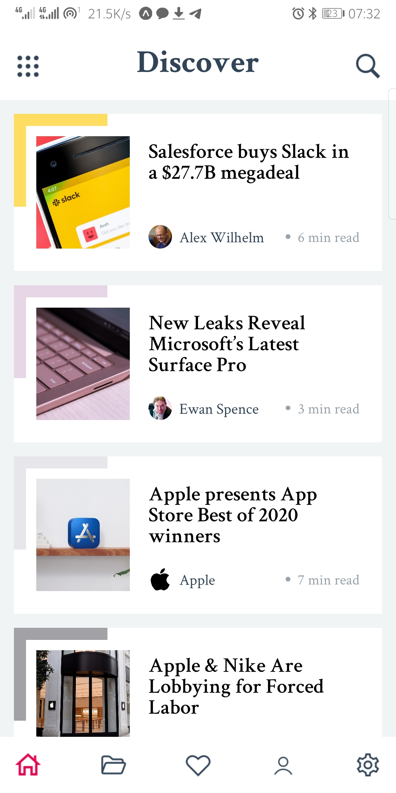
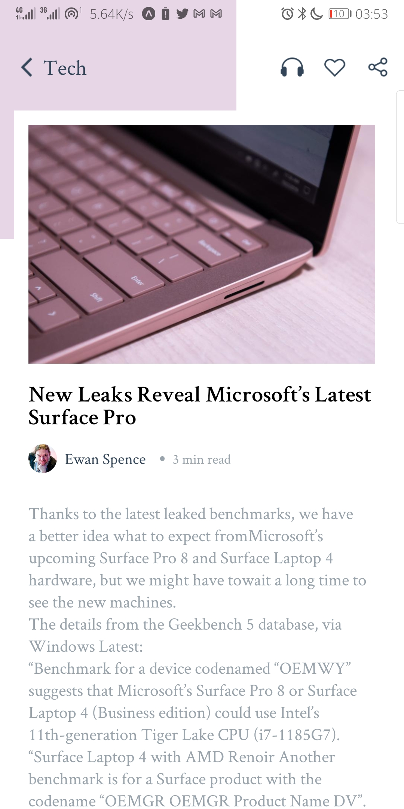
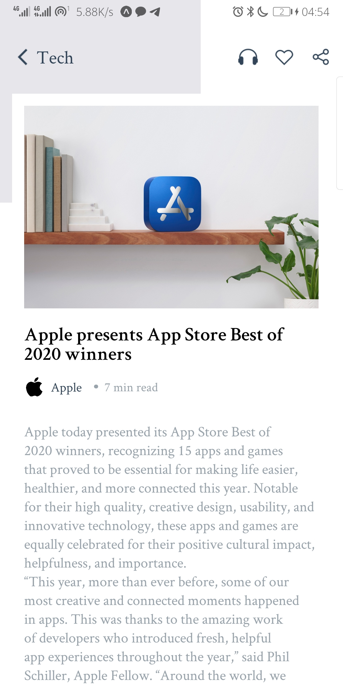

# Blog App
This yet another Codetrain assignment on mobile development (react native) :)
  
This app was bootstrapped using the [expo cli](https://expo.io/)

## How To Run This App
1. Install expo using [this guide](https://docs.expo.io/get-started/installation/).
2. Clone this repository.
3. Install the expo client Andriod/iOS app on your phone.
4. Prepare the app
	- Open the cloned directory in your terminal.
	- Enter `npm install` or `yarn` to install the app dependencies.
5. Start the app
	- In your terminal, enter `expo start`  to start the development server. then 👇,
	 

	> On your iPhone or iPad, open the default Apple "Camera" app and scan the QR code you see in the terminal or in Expo Dev Tools.

	> 🤖 On your Android device, press "Scan QR Code" on the "Projects" tab of the Expo client app and scan the QR code you see in the terminal or in Expo Dev Tools.

	[*A more elaborate guide*](https://docs.expo.io/get-started/create-a-new-app/#opening-the-app-on-your-phonetablet)

## Screenshots

	
	
	

*more in the screenshots folder*

### Demo (gif)

